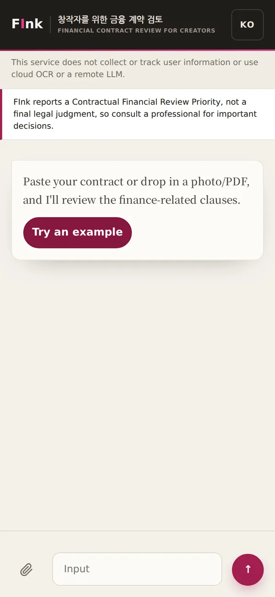
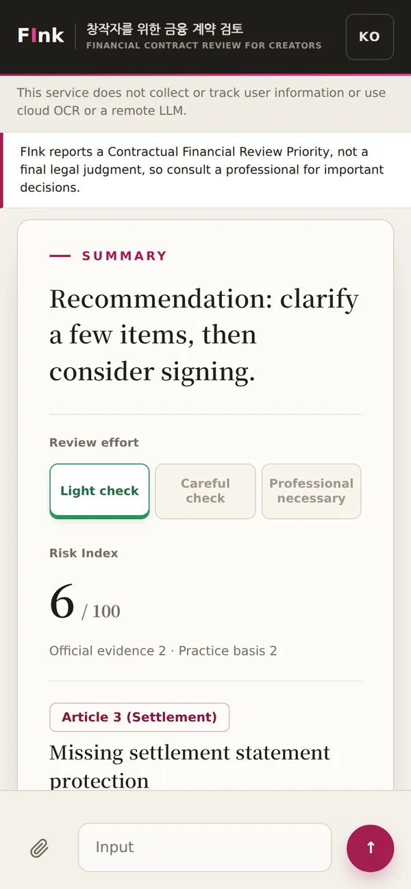
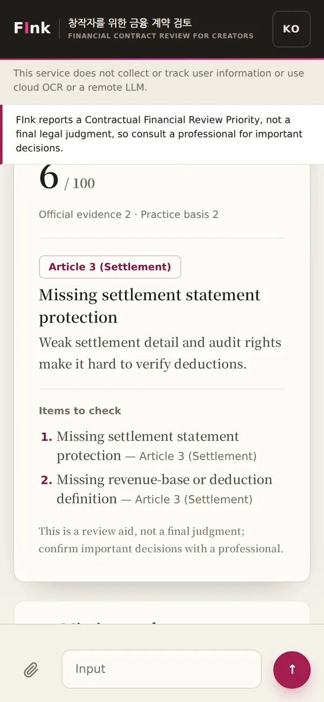

<p align="center">
  
</p>

<h1 align="center">FInk</h1>

<p align="center">
  <strong>A Financial-Risk Review Assistant for Creator Contracts</strong><br /><br />
  <em>UNIST · IE412 AI for Finance · 2026 Spring · Final Project</em><br /><br />
  <a href="https://fink.seonukkim.com"></a>
  <a href="https://fink.seonukkim.com/fink_paper.pdf"></a>
</p>

<p align="center">
  
  
  
</p>

FInk is an on-device assistant that reviews a creator's contract for financial
risk and shows what to check before signing. It detects risk in each clause,
grounds every flag in official Korean financial and legal sources through BM25
retrieval, and returns a prioritized review — a 0–100 score, a recommended review
effort, and ranked, source-cited findings — plus a local chatbot for follow-up
questions. Everything runs on the device. It is decision support, not legal advice.

### Run it

```bash
git clone https://github.com/seonukkim/fink
cd fink
uv sync --extra web
uv run fink-web --host 127.0.0.1 --port 8000
# wait for "Uvicorn running on http://127.0.0.1:8000", then open that address
```

Photo/PDF input and the on-device chat model are optional:

```bash
uv sync --extra ocr      # PP-OCR for images and scanned PDFs
uv sync --extra chat     # on-device chat model runtime
FINK_MODEL_DOWNLOAD_ALLOWED=true uv run fink-models download   # one-time chat-model fetch
```
